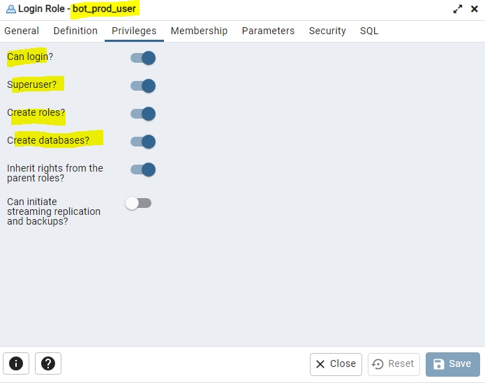
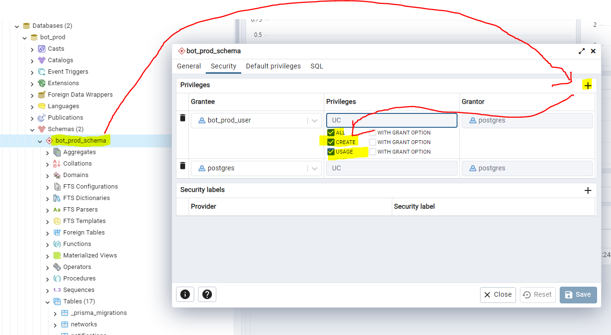

# Docker weirdness

Somehow inside Dockerfile, both docker secrets and volumes are not existing within the docker container.

```
# The file must be named id_ed25519
COPY --chown=node:node ./secrets/docker-volume/id_ed25519 /secrets/id_ed25519

# Assuming the key is mounted at /secrets/id_ed25519
# Start the SSH agent, add the private key, and set up known hosts
# RUN mkdir -p ~/.ssh && \
#     ssh-keyscan -H github.com >> ~/.ssh/known_hosts && \
#     eval "$(ssh-agent -s)" && \
#     ssh-add /secrets/id_ed25519 && \
#     echo "Host github.com\n\tIdentityFile /secrets/id_ed25519\n\tStrictHostKeyChecking no\n" >> ~/.ssh/config && \
#     ssh -T git@github.com
    # The below can check if the github access is working
    
# RUN ssh -T git@github.com
```

Hence, need to copy the file directly from host machine to container.
```
COPY --chown=node:node ./secrets/docker-volume/id_ed25519 /secrets/id_ed25519
```

The command `RUN ssh -T git@github.com` fails when it is a separate `RUN` command from 
```
RUN mkdir -p ~/.ssh && \
    ssh-keyscan -H github.com >> ~/.ssh/known_hosts && \ ...
    ...
```

Not sure why.

Current working solution:

```
# Install app dependencies using the `npm ci` command instead of `npm install`
# `npm ci && npm cache clean --force` must be in the same RUN command as
# `echo "Host github.com\n\tIdentityFile /secrets/id_ed25519\n\tStrictHostKeyChecking no\n" >> ~/.ssh/config && \` for this to work
RUN mkdir -p ~/.ssh && \
    ssh-keyscan -H github.com >> ~/.ssh/known_hosts && \
    eval "$(ssh-agent -s)" && \
    ssh-add /secrets/id_ed25519 && \
    echo "Host github.com\n\tIdentityFile /secrets/id_ed25519\n\tStrictHostKeyChecking no\n" >> ~/.ssh/config && \
    npm ci && npm cache clean --force
```

The line `npm ci && npm cache clean --force` need to be in the same `RUN` command as `RUN mkdir -p ~/.ssh && \ ...`.

# USER node needs to go to last

Errors:

```bash
#16 [bot-test-dev development 4/7] COPY --from=build /usr/src/app/build-dev ./build-dev
#16 ERROR: failed to calculate checksum of ref e624f1fb-912b-49a6-9a4a-accdd294aaf4::v2e0gnz4iabnmqym0fedhae3a: "/usr/src/app/build-dev": not found
```

```bash
#16 [bot-test-dev build 11/12] RUN npm run build-dev
#16 1.134 
#16 1.134 > jacob-bot-template@0.1.0 build-dev
#16 1.134 > rm -fr build-dev && cross-env NODE_ENV=development tsc --outDir ./build-dev && npm run copy-files-dev
#16 1.134 
#16 4.150 error TS5033: Could not write file '/usr/src/app/build-dev/src/bin/main.js': EACCES: permission denied, mkdir '/usr/src/app/build-dev'.
#16 4.151 error TS5033: Could not write file '/usr/src/app/build-dev/src/core/index.js': EACCES: permission denied, mkdir '/usr/src/app/build-dev'.
#16 4.197 npm notice 
#16 4.198 npm notice New minor version of npm available! 10.5.0 -> 10.7.0
#16 4.199 npm notice Changelog: <https://github.com/npm/cli/releases/tag/v10.7.0>
#16 4.200 npm notice Run `npm install -g npm@10.7.0` to update!
#16 4.201 npm notice 
#16 ERROR: process "/bin/sh -c npm run build-dev" did not complete successfully: exit code: 2
```

That is because in the `Dockerfile`, it was:

```Dockerfile
USER node # user comes first
RUN npm run build-dev # npm run build-dev involves `rm -fr build-dev`, user node does not have the permission
RUN npm run build-prod

CMD ls -la . && pwd -P && echo "BUILDS FOR LOCAL DEVELOPMENT AND PRODUCTION ARE COMPLETED!"
```

Solution:

```Dockerfile
RUN npm run build-dev
RUN npm run build-prod

USER node # change the user to `node` at the last
CMD ls -la . && pwd -P && echo "BUILDS FOR LOCAL DEVELOPMENT AND PRODUCTION ARE COMPLETED!"
```

# See if `tsconfig.json`'s `include` option will work or not, then no need to `copyfiles`.

## Conclusion: `tsconfig.json`'s `include` option does **NOT** work
`include` looks like this in `tsconfig.json`:
```
"include": [
      "src/**/*.ts",
      "src/**/*.js",
      "src/**/*.d.mts",
      "src/**/*.d.ts", 
      "src/**/*.js.map",
      "src/**/*.mjs",
      "src/**/*.mjs.map",
    ],
```

but the `build` folder is:

(to produce the tree diagram below, use `find build | sed -e "s/[^-][^\/]*\//  |/g" -e "s/|\([^ ]\)/|-\1/" `)

```
build
  |-src
  |  |-index.js
  |  |-bin
  |  |  |-main.js
  |  |-core
  |  |  |-common
  |  |  |  |-configs
  |  |  |  |  |-index.js
  |  |  |  |-secrets
  |  |  |  |  |-index.js
  |  |  |-index.js
  |-.env.production
  |-package.json
  |-package-lock.json
  |-secrets
  |  |-.db.production
  |  |-.crypto.production
  |  |-.minio.production
  |  |-.secrets.production
```

Clearly, there is no `src/**/*/d.ts`, etc. files.

# Database Issue One

Error

```
root@vmi1175516:~/solana_projects/jacob-bot-template# npm run prisma:dev-create-only

> jacob-bot-template@0.1.0 prisma:dev-create-only
> dotenv -e secrets/.db.development -e .env.development -- npx prisma migrate dev --create-only

Prisma schema loaded from prisma/schema.prisma
Datasource "db": PostgreSQL database "bot_testing_db_dev", schema "bot_testing" at "194.163.151.162:7457"

Error: P1000: Authentication failed against database server at `194.163.151.162`, the provided database credentials for `bot_testing_db_user_dev` are not valid.

Please make sure to provide valid database credentials for the database server at `194.163.151.162`.
```

Solution:

`.env.development`
```
POSTGRESQL_DATABASE=bot_testing_db_dev
POSTGRESQL_USERNAME=bot_testing_db_user_dev
DATABASE_SCHEMA=bot_testing
DATABASE_ADDRESS=bot_testing_db_dev
DATABASE_PORT=7449
DATABASE_URL=postgresql://${POSTGRESQL_USERNAME}:${POSTGRESQL_PASSWORD}@${DATABASE_IP_ADDRESS}:${DATABASE_PORT}/${POSTGRESQL_DATABASE}?schema=${DATABASE_SCHEMA}
```
Make sure use `npx dotenv -e .env.development -e secrets/.db.development ...` for interpolation and the error was due to the wrong database port.

# Database Issue Two

Error:

```
root@vmi1175516:~/solana_projects/jacob-bot-template# npm run prisma:dev-create-only

> jacob-bot-template@0.1.0 prisma:dev-create-only
> dotenv -e secrets/.db.development -e .env.development -- npx prisma migrate dev --create-only

Prisma schema loaded from prisma/schema.prisma
Datasource "db": PostgreSQL database "bot_testing_db_dev", schema "bot_testing" at "194.163.151.162:7449"

Error: ERROR: no schema has been selected to create in
   0: sql_schema_connector::sql_migration_persistence::initialize
           with namespaces=None
             at schema-engine/connectors/sql-schema-connector/src/sql_migration_persistence.rs:14
   1: schema_core::state::ApplyMigrations
             at schema-engine/core/src/state.rs:202
```

Solution:
https://stackoverflow.com/a/41207765/19504610

```
GRANT CREATE, USAGE ON SCHEMA bot_testing TO bot_testing_db_user_dev;
```

# Big problem with Prisma

Error:
```
bot-test-dev               | Error during database setup check: PrismaClientInitializationError: 
bot-test-dev               | Invalid `prisma.permission.count()` invocation:
bot-test-dev               | 
bot-test-dev               | 
bot-test-dev               | Prisma Client could not locate the Query Engine for runtime "linux-musl-openssl-3.0.x".
bot-test-dev               | 
bot-test-dev               | This is likely caused by a bundler that has not copied "libquery_engine-linux-musl-openssl-3.0.x.so.node" next to the resulting bundle.
bot-test-dev               | Ensure that "libquery_engine-linux-musl-openssl-3.0.x.so.node" has been copied next to the bundle or in "node_modules/.prisma/client".
bot-test-dev               | 
bot-test-dev               | We would appreciate if you could take the time to share some information with us.
bot-test-dev               | Please help us by answering a few questions: https://pris.ly/engine-not-found-bundler-investigation
bot-test-dev               | 
bot-test-dev               | The following locations have been searched:
bot-test-dev               |   /usr/src/app/build-dev/node_modules/.prisma/client
bot-test-dev               |   /usr/src/app/build-dev/src
bot-test-dev               |   /root/solana_projects/jacob-bot-template/node_modules/@prisma/client
bot-test-dev               |   /usr/src/app/.prisma/client
bot-test-dev               |   /tmp/prisma-engines
bot-test-dev               |   /usr/src/app/build-dev/prisma
bot-test-dev               |     at In.handleRequestError (/usr/src/app/build-dev/src/bin/main.js:132:7169)
bot-test-dev               |     at In.handleAndLogRequestError (/usr/src/app/build-dev/src/bin/main.js:132:6203)
bot-test-dev               |     at In.request (/usr/src/app/build-dev/src/bin/main.js:132:5911)
bot-test-dev               |     at async l (/usr/src/app/build-dev/src/bin/main.js:137:11167)
bot-test-dev               |     at async bh (/usr/src/app/build-dev/src/bin/main.js:452:35077) {
bot-test-dev               |   clientVersion: '5.14.0',
bot-test-dev               |   errorCode: undefined
bot-test-dev               | }
```

Solution:

Turns out, in `Dockerfile`, should do

```
COPY --from=build /usr/src/app/build .
COPY --from=build /usr/src/app/node_modules ./node_modules
```

instead of
```
COPY --from=build /usr/src/app/build ./build # should not be `./build` but just `.`
COPY --from=build /usr/src/app/node_modules ./node_modules
```

Because `/usr/src/app` is the current working directory of this repo where `prisma` directory, `secrets` directory and `node_modules` directory are residing.
`build` directory from the `build` stage of `Dockerfile` is just a directory that acts like a placeholder to dump / copy all the files from local machine into the docker container.
Consequently, `prisma` will search in `/usr/src/app/node_modules/.prisma/client` instead of `/usr/src/app/build-dev/node_modules/.prisma/client` for the library.

The binary like `libquery_engine-...` are present in `./node_modules/.prisma/client`.
```
bot-test-dev               | Running ls -la ./node_modules/.prisma/client
bot-test-dev               | total 32748
bot-test-dev               | drwxr-xr-x    3 root     root          4096 May 25 16:53 .
bot-test-dev               | drwxr-xr-x    3 root     root          4096 May 25 16:15 ..
bot-test-dev               | -rw-r--r--    1 root     root            23 May 25 16:53 default.d.ts
bot-test-dev               | -rw-r--r--    1 root     root            36 May 25 16:53 default.js
bot-test-dev               | drwxr-xr-x    2 root     root          4096 May 25 16:52 deno
bot-test-dev               | -rw-r--r--    1 root     root            25 May 25 16:53 edge.d.ts
bot-test-dev               | -rw-r--r--    1 root     root         60045 May 25 16:53 edge.js
bot-test-dev               | -rw-r--r--    1 root     root         11553 May 25 16:53 index-browser.js
bot-test-dev               | -rw-r--r--    1 root     root        890825 May 25 16:53 index.d.ts
bot-test-dev               | -rw-r--r--    1 root     root         60752 May 25 16:53 index.js
bot-test-dev               | -rwxr-xr-x    1 root     root      16243536 May 25 16:15 libquery_engine-debian-openssl-3.0.x.so.node
bot-test-dev               | -rwxr-xr-x    1 root     root      16202656 May 25 16:53 libquery_engine-linux-musl-openssl-3.0.x.so.node
bot-test-dev               | -rw-r--r--    1 root     root          2316 May 25 16:53 package.json
bot-test-dev               | -rw-r--r--    1 root     root         11427 May 25 16:53 schema.prisma
bot-test-dev               | -rw-r--r--    1 root     root            23 May 25 16:53 wasm.d.ts
bot-test-dev               | -rw-r--r--    1 root     root         11553 May 25 16:53 wasm.js
```

# Cannot run `npm run prisma:prod-deploy`

Error:

```
root@vmi1175516:~/solana_projects/jacob-bot-template# npm run prisma:prod-deploy

> jacob-bot-template@0.1.0 prisma:prod-deploy
> dotenv -e secrets/.db.production -e .env.production -- npx prisma migrate deploy

Prisma schema loaded from prisma/schema.prisma
Datasource "db": PostgreSQL database "bot_prod", schema "bot_prod_schema" at "194.163.151.162:7450"

Error: P1010: User `bot_prod_user` was denied access on the database `bot_prod.bot_prod_schema`
```

Solution




# IDE like `cursor.sh` or `VSCode` becomes very laggy with SSH when upgraded.

Solution:

1. Don't update.
2. If updated, uninstall it and install a lower version.